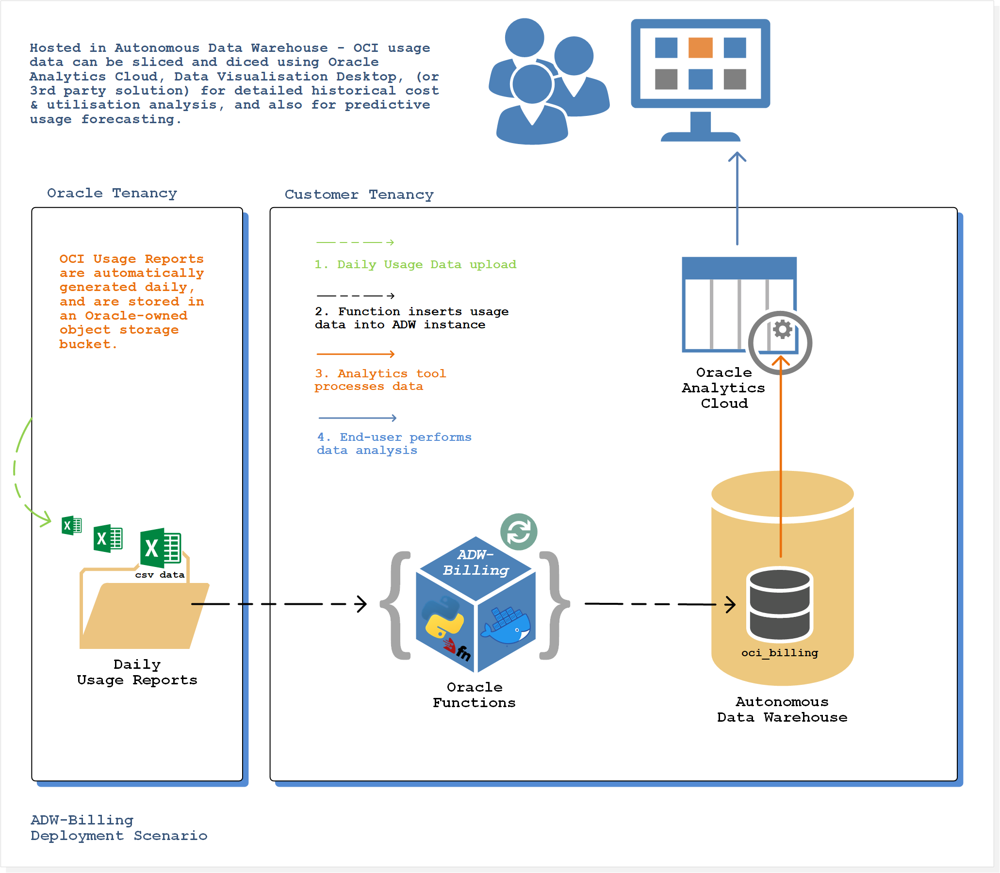

[oci]:[https://cloud.oracle.com/en_US/cloud-infrastructure]
[oke]:[https://cloud.oracle.com/containers/kubernetes-engine]
[oci-signup]:[https://cloud.oracle.com/tryit]

# Deploying an Oracle Serverless Function to upload OCI Usage Reports to the Oracle Autonomous Data Warehouse

## Introduction
When using cloud computing services, it seems simple to say that managing costs is critical to success. As it turns out - the task of managing cloud computing costs can be easier said than done. Incurring unplanned costs can often be the result of a combination of factors, such as a lack of visibility about the current consumption patterns and past trends, non-standard deployments which can originate from an absence development and authorisation processes, a lack of organisation, or the absence of automated deployment and configuration tools.

A combination of tooling and controls is critical in empowering organisations to effectively plan, forecast and manage cloud computing costs. Factors such as consolidated visibility of cloud inventory, policy based governance, role based access control, controlled stack templates, automated alerts and notifications, and cost analytics are essential.

Oracle Cloud Infrastructure ([OCI][oci]) provides a compliment of native controls, billing, and payment tools that make it easy to manage your service costs. For example, OCI Budgets can be used to set and manage limits on your Oracle Cloud Infrastructure spending. You can set alerts on your budget to let you know when you might exceed your budget, and you can view all of your budgets and spending from one single place in the OCI console. Among other controls, such as Compartments and cost-tracking tags - OCI also provides a Cost Analysis dashboard, and access to Usage Reports.

An OCI Usage Report is a comma-separated value (CSV) file that can be used to get a detailed breakdown of your Oracle Cloud Infrastructure resources for audit or invoice reconciliation.

In this tutorial we'll take you through a deployment scenario on OCI, whereby an Oracle Function (i.e. a managed serverless function) will be deployed to automatically to retreive OCI Usage Reports, and upload the data to an Autonomous Data Warehouse (ADW) instance.
Storing the historical Usage Data in ADW provides a well managed repository for the historical account utilisation data, as well as making it available for introspection and analysis by popular analytics tooling such as Oracle Data Visualisation Desktop (DVD), or Oracle Analytics Cloud (OAC). These powerful data analysis tools will enable you to perform deep and comprehensive introspection of cloud resource utilisation, and also provide the ability to perform predictive cost analyses based on historical usage trends.

### About OCI Usage Reports
The OCI Usage Report is automatically generated daily, and is stored in an Oracle-owned object storage bucket. It contains one row per each Oracle Cloud Infrastructure resource (such as instance, object storage bucket, VNIC) per hour along with consumption information, metadata, and tags. Usage reports are retained for one year.

A comprehensive overview of the Usage Report schema is available [here](https://docs.cloud.oracle.com/iaas/Content/Billing/Concepts/usagereportsoverview.htm).

### About Oracle Functions
Oracle Functions is a fully managed, highly scalable, on-demand, Functions-as-a-Service (FaaS) platform, built on enterprise-grade Oracle Cloud Infrastructure and powered by the Fn Project open source engine. With Oracle Functions, you can deploy your code, call it directly or trigger it in response to events, and get billed only for the resources consumed during the execution.

Oracle Functions are "container-native". This means that each function is a completely self-contained Docker image that is stored in your OCIR Docker Registry and pulled, deployed and invoked when you invoke your function.

## Tutorial Overview
Let’s consider an example of how we can;

 - Provision an ADW instance & a database table to host our OCI tenancy Usage Report data.
 - Create a custom Oracle Function to programatically retreive daily CSV data from the Object Storgae Service, and insert the data into ADW.



The Oracle Function itself is written in Python (see `../oci-usage-to-adw-function/adw-billing/func.py`).  
The function uses a custom container image based on oraclelinux:7-slim, and also includes oracle-instantclient19.3-basiclite, and rh-python36 (see `../oci-usage-to-adw-function/adw-billing/Dockerfile`).

When invoked, the function uses a call to a 'resource principal provider' that enables the function to authenticate and access the Usage Reports Object Storage (OSS) bucket, and to also download the credentials wallet used to access the ADW instance.

The function enumerates the usage reports contained within the OSS bucket, and will insert into the `oci_billing` table all Usage Reports data that has not previously been insterted. This means that the first time the function is invoked, an initial bulk upload of all historical Usage Report data will occur. For subsequent function invocations, only new Usage Data will be processed.

Resources referenced in this tutorial will be named as follows:

 - Compartment containing the ADW instance: ***Demo-Compartment***
 - OCI IAM Dynamic Group Name: ***FnFunc-Demo***
 - Oracle Functions Application Name: ***billing***
 - Function Name: ***adw-billing***

### Prerequisites
The following should be completed before going ahead and creating your Oracle Cloud Function:
 - **OCI Tenancy:** If you don't already have an OCI tenancy, you can sign-up right [here](https://www.oracle.com/cloud/free/) and experience the benefits of OCI with the included always free services, including Autonomous Data Warehouse!
 - **Deploy an Autonomous Data Warehouse:** You will need to have deployed your Autonomous Data Warehouse instance prior to commencing implementation of the deployment scenario. Follow the link to [this tutorial](https://docs.cloud.oracle.com/iaas/Content/Database/Tasks/adbcreating.htm) for guidance on the process.
 - **Download the DB Client Credential Package (Credentials Wallet):** Information contained within the wallet will be used later in the tutorial. Follow the link to [this tutorial](https://docs.cloud.oracle.com/iaas/Content/Database/Tasks/adbconnecting.htm) for guidance on the process.
 - **Access the Usage Reports Bucket:** OCI IAM policies are required to be configured in order to access Usage Reports. Follow [this tutorial](https://docs.cloud.oracle.com/iaas/Content/Billing/Tasks/accessingusagereports.htm) for guidance on the process.
 - **Set up your tenancy for function development:** Follow the link to [this tutorial](https://docs.cloud.oracle.com/iaas/Content/Functions/Tasks/functionsconfiguringtenancies.htm) for guidance on the process.
 - **Configure Your Client Environment for Function Development:** Before you can start using Oracle Functions to create and deploy functions, you have to set up your client environment for function development. Follow the link to [this tutorial](https://docs.cloud.oracle.com/iaas/Content/Functions/Tasks/functionsconfiguringclient.htm) for guidance on the process.

### Additional IAM Policies
When a function you've deployed to Oracle Functions is running, it can access other Oracle Cloud Infrastructure resources. To enable a function to access another Oracle Cloud Infrastructure resource, you have to include the function in a dynamic group, and then create a policy to grant the dynamic group access to that resource. Follow the link to [this tutorial](https://docs.cloud.oracle.com/iaas/Content/Functions/Tasks/functionsaccessingociresources.htm) for guidance on creating a dynamic group. 

For our deployment scenario we'll require our "FnFunc-Demo" dynamic group to access both the Usage Report object storage bucket, as well as our Autonomous Database instance. To enable this, create the following dynamic group and additional IAM policies:

#### Dynamic group
For the below dynamic group definition, the `resource.compartment.id` is that of the "Demo-Compartment" where the application and associated function will be deployed:
```
ALL {resource.type = 'fnfunc', resource.compartment.id = 'ocid1.compartment.oc1..aaaaaaaafnaar7sww76or6eyb3j625uji3tp4cb4tosaxx4wbxvvag4dkrra'}
```

#### IAM policies
Create the additional IAM policies:
```
endorse dynamic-group FnFunc-Demo to read objects in tenancy usage-report
allow dynamic-group FnFunc-Demo to use autonomous-databases in compartment Demo-Compartment where request.permission='AUTONOMOUS_DATABASE_CONTENT_READ'
```

### Create `oci_billing` Database Table
Next we create our database table which will store the Usage Report data. To do this we will use the ADW instance built-in SQL Developer Web client. Follow the link to [this tutorial](https://docs.oracle.com/en/cloud/paas/autonomous-data-warehouse-cloud/user/sql-developer-web.html#GUID-102845D9-6855-4944-8937-5C688939610F) for guidance on accessing SQL Developer Web as user ADMIN from your Autonomous Data Warehouse. Once connected, run the following SQL statement to create the `oci_billing` table:

``` sql
create table oci_billing(usage_report varchar2(150 CHAR), lineItem_referenceNo varchar2(150 CHAR), lineItem_tenantId varchar2(150 CHAR),  
lineItem_intervalUsageStart varchar2(150 CHAR), lineItem_intervalUsageEnd varchar2(150 CHAR), product_service varchar2(150 CHAR),  
product_resource varchar2(150 CHAR), product_compartmentId varchar2(150 CHAR), product_compartmentName varchar2(150 CHAR),  
product_region varchar2(150 CHAR), product_availabilityDomain varchar2(150 CHAR), product_resourceId varchar2(150 CHAR),  
usage_consumedQuantity varchar2(150 CHAR), usage_billedQuantity varchar2(150 CHAR), usage_consumedQuantityUnits varchar2(150 CHAR),  
usage_consumedQuantityMeasure varchar2(150 CHAR), lineItem_isCorrection varchar2(150 CHAR), lineItem_backreferenceNo varchar2(150 CHAR));
```

### Create Oracle Functions Application: `billing`
In Oracle Functions, an application is a logical grouping of functions & a common context to store configuration variables that are available to all functions in the application. 
Next, create an application named `billing` to host the `adw-billing` function. Follow the link to [this tutorial](https://docs.cloud.oracle.com/iaas/Content/Functions/Tasks/functionscreatingapps.htm) for guidance on the process.

When creating applications, Oracle recommends that you use the same region as the Docker registry that's specified in the Fn Project CLI context, and be sure to select the compartment specified in the Fn Project CLI context.

### Create Function: `adw-billing`
Now to create the actual function!

#### Clone the `oci-adw-billing-tutorial` git repository
First, let's clone the `oci-adw-billing-tutorial` repository:

```
$ git clone https://github.com/cameronsenese/oci-usage-to-adw-function.git
```

Commands from this point forward will assume that you are in the `../oci-usage-to-adw-function/adw-billing` directory, which is the directory containing the function code, and other dependencies such as the Dockerfile used to build the container image, the func.yaml (function configuration file), and a Python requirements definition file.

### Create the function
Enter the following single Fn Project command to build the function and its dependencies as a Docker image, push the image to the specified Docker registry, and deploy the function to Oracle Functions:

```
$ fn -v deploy --app billing
```

The Fn Project CLI will generate output similar to the following (abbreviated) detailing the steps taken to build and deploy the function.
```
$ Deploying adw-billing to app: billing
$ Bumped to version 0.0.1
$ Building image...
$ ...
$ ...
$ 0.0.1: digest: sha256:71c0f9fac6164b676b781970b5d79b86a28838081c6ea88e00cc1cf07630ccc6 size: 1363
$ Updating function adw-billing using image iad.ocir.io/tenancy/fnbilling/adw-billing:0.0.1...
```

### Implement function configuration parameters
Now that we have our function built and deployed - it requires the creation of a number of configuration parameters in order for it to operate successfully. User defined configuration parameters are made available to the function via key-value pairs known as custom configuration parameters.

To specify custom configuration parameters using the Fn Project CLI, the following command format is used:
```
$ fn config function <app-name> <function-name> <key> <value>
```

Create the following custom configuration parameters using the cofig function command:

*-- Tenancy Usage Report Bucket*
```
$ fn config function billing adw-billing usage_report_bucket <value>
```
The `<value>` field should contain the OCI tenancy OCID.

*-- Credentials Wallet Configuration*
```
$ fn config function billing adw-billing TNS_ADMIN /tmp/wallet
```
After invocation, the function will connect to the ADW instance and download and extract a copy of the credentials wallet (containing tsnames.ora) to the path /tmp/wallet. The `TNS_ADMIN` environment variable is used to specify the directory location for the tnsnames.ora file, which is used by the Oracle Instant Client when connecting to the ADW instance.

*-- Database connection DSN*
```
$ fn config function billing adw-billing db_dsn <value>
```
The `<value>` field should contain the preferred DSN connection string for the database.  

An ODBC DSN specifies the database server name, and other database-related information required to access the Autonomous Data Warehouse instance.
Available DSNs are contained within the tsnames.ora file, which is located in the credentials wallet previously downloaded in the Prerequisites section herein.  

The tsnames.ora file will contain multiple DSNs of the format `name = (configuration data)`, e.g.
```
db201908233333_high = (description= (address=(protocol=tcps)(port=1522)(host=adb.us-ashburn-1.oraclecloud.com))(connect_data=(service_name=aaaaaaaaaayxrey_db201908233333_high.adwc.oraclecloud.com))(security=(ssl_server_cert_dn=
        "CN=adwc.uscom-east-1.oraclecloud.com,OU=Oracle BMCS US,O=Oracle Corporation,L=Redwood City,ST=California,C=US"))   )
```
In the case of the above example, the required `<value>` will be the name `db201908233333_high`.

*-- Autonomous Database OCID*
```
$ fn config function billing adw-billing db_ocid <value>
```
The `<value>` field should contain the Autonomous Database instance OCID. The ADW instance OCID can be found in the OCI console on Autonomous Database Details page for your ADW instance.

*-- Autonomous Database Username*
```
$ fn config function billing adw-billing db_user ADMIN
```

*-- Autonomous Database Password*
```
$ fn config function billing adw-billing db_pass <value>
```
The `<value>` field should contain the ADW ADMIN user password specified during the instance creation.

### Configure function logging
When a function you've deployed to Oracle Functions is invoked, you'll typically want to store the function's logs so that you can review them later. You specify where Oracle Functions stores a function's logs by setting a logging policy for the application containing the function. Follow the link to [this tutorial](https://docs.cloud.oracle.com/iaas/Content/Functions/Tasks/functionsexportingfunctionlogfiles.htm) for guidance on the process.

### Invoke the function
To invoke the function, issue the following command:
```
$ fn invoke billing adw-billing
```
That's it! Once completed, your function has now inserted all historical Usage Report data into your ADW instance.  
*Note: The current maximum run time for an Oracle Function is 120 seconds. If your tenancy has hundreds of historical Usage Reports to process (there can be up to 365), then it may take a couple of invocations to completely process the data backlog..*

### Function return data
The function will return a JSON array containing the name of each of the Usage Report files that were processed during the given invocation, e.g.
``` JSON
["0001000000010470.csv", "0001000000010480.csv"]
```

### Inspect function logs
The function has been configured to provide some basic logging regarding it's operation.  
The following excerpt illustrates the function log data relating to the download and processing of a single Usage Report file:

```
oci.base_client.139777842449152 - INFO -  2019-10-17 06:17:41.425456: Request: GET https://objectstorage.us-ashburn-1.oraclecloud.com/n/bling/b/ocid1.tenancy.oc1..aaaaaaaac3l6hgyl../o/reports/usage-csv/0001000000076336.csv.gz 
oci._vendor.urllib3.connectionpool - DEBUG - https://objectstorage.us-ashburn-1.oraclecloud.com:443 "GET /n/bling/b/ocid1.tenancy.oc1..aaaaaaaac3l6hgyl../o/reports/usage-csv/0001000000076336.csv.gz HTTP/1.1" 200 256997 
...
...
root - INFO - finished downloading 0001000000076336.csv.gz
root - INFO - finished uploading 0001000000076336.csv.gz
root - INFO - report_id: ocid1.tenancy.oc1..aaaaaaaac3l6hgyl..-0001000000076776: 0
root - INFO - runtime: 06.092967748641968 seconds
```

### Inspect uploaded Usage Data via SQL Developer Web client
Finally - let's use the ADW instance built-in SQL Developer Web client to take a look at the usage data as stored in our data warehouse. Once connected to the SQL Developer Web client, run the following SQL statement:
``` sql
SELECT * FROM oci_billing;
```

On observation of the result set - you will note that each of the columns in the database correlate to fields as contained within Usage Report CSV files.  

The only exception is the column `usage_report`, which has been included to help ensure records remain unique - particularly if you are hosting usage data from multiple tenancies within a single database. It's also used by the function to determine if a given Usage Report file has been previosly inserted into the database.  

The `usage_report` field stores a value that is a concatenation of the OCI tenancy OCID and the Usage Report CSV file name from which the data was sourced, for example:

```
USAGE_REPORT
------------------------------------------------------------------------------------------------
ocid1.tenancy.oc1..aaaaaaaac3l6hgylozzuh2bxhf3557quavpa2v6675u2kejplzalhgk4nzka-0001000000010470
ocid1.tenancy.oc1..aaaaaaaac3l6hgylozzuh2bxhf3557quavpa2v6675u2kejplzalhgk4nzka-0001000000010470
ocid1.tenancy.oc1..aaaaaaaac3l6hgylozzuh2bxhf3557quavpa2v6675u2kejplzalhgk4nzka-0001000000010470
```

### To-Do:
- Provide mechanism to include tags (complex)..  
  Usage Report data contains a record of all tags associated with a given resource at the time of the report generation. At present, the billing function does not include the tag data. Enhancement would be to include a mechanism to upload to ADW the tags associated with each resource.
